<div align="center">


# OVERPANEL

**Nowoczesny panel hostingowy VPS**

*Piękny, rozbudowany panel do zarządzania serwerem Ubuntu — alternatywa dla CloudPanel, HestiaCP i Webmin.*

[Instalacja](#-instalacja) · [Funkcje](#-funkcje) · [Architektura](#-architektura) · [Screenshots](#-screenshots)

</div>

---

## Czym jest OVERPANEL?

OVERPANEL to autorski panel hostingowy zaprojektowany od podstaw z myślą o estetyce, wydajności i rozszerzalności. Ciemny, glassmorphism design z akcentami w kolorach pink/purple. Jeden skrypt instalacyjny — pełen serwer hostingowy gotowy w kilka minut.

---

## Instalacja

```bash
apt install -y curl && bash <(curl -sSL https://raw.githubusercontent.com/jurfader/overpanel/main/install.sh)
```

Instalator automatycznie:
- Wykrywa system (Ubuntu 20/22/24)
- Instaluje wszystkie zależności (Node.js, Nginx, MySQL, PostgreSQL, PHP, Docker)
- Konfiguruje firewall (UFW)
- Buduje i uruchamia panel
- Wystawia SSL (Let's Encrypt / Cloudflare)
- Tworzy serwisy systemd (auto-start)

---

## Funkcje

### Zarządzanie stronami
- Tworzenie stron: PHP, Node.js, Python, Static HTML, WordPress, OverCMS
- Nginx vhosty z automatyczną konfiguracją
- PHP-FPM z wyborem wersji (7.4 — 8.3) i per-site ustawieniami
- PM2 integration dla aplikacji Node.js
- Reverse proxy do dowolnego portu

### WordPress Auto-Installer
- Jednoklinkowa instalacja przez WP-CLI
- Wybór silnika bazy (MySQL / PostgreSQL)
- Wybór języka (PL, EN, DE, FR, ES)
- Aktualizacja WP + pluginów z panelu
- Auto-backup przed aktualizacją

### OverCMS Integration

OverCMS to autorski, modularny headless CMS stworzony przez OVERMEDIA — nowoczesna alternatywa dla WordPress, dostępna bezpośrednio jako typ strony w OVERPANEL.

**Instalacja jednym kliknięciem:**
- Formularz: domena, e-mail admina, hasło, klucz licencyjny (opcjonalnie)
- OVERPANEL klonuje repozytorium, generuje `.env`, buduje obrazy Docker
- Live log instalacji (każdy krok widoczny w czasie rzeczywistym)
- Po zakończeniu CMS gotowy pod podaną domeną z zalogowanym kontem admina

**Architektura OverCMS (automatycznie konfigurowana przez OVERPANEL):**
- **Admin** (Next.js 15) — panel zarządzania treścią
- **API** (Hono.js) — backend REST, moduły, media, auth
- **Web** (Next.js 15) — publiczna strona z ISR
- **PostgreSQL** — główna baza z Drizzle ORM
- **Redis** — cache, sesje, kolejki
- **MinIO** — S3-compatible object storage (media, pliki do 50 MB)
- Nginx bez Traefika — integruje się z istniejącym Nginx OVERPANEL

**Zarządzanie treścią:**
- Kreator typów treści z edytorem pól drag-and-drop (16+ typów: text, richtext, blocks, image, file, relation, repeater, select, date, color, json…)
- Workflow publikowania: szkic → opublikowany → zaplanowany → archiwalny
- Historia wersji z możliwością przywrócenia dowolnego snapshota
- Singleton content types (np. strona „O nas")
- SEO per wpis: meta, Open Graph, Twitter Card, canonical, noIndex

**System modułów (rozszerzenia):**
- **Blog** — listy postów, RSS feed, paginacja
- **Formularze** — kreator formularzy (text, email, select, checkbox…), powiadomienia e-mail przez Resend, eksport CSV zgłoszeń
- **Portfolio** — typ treści dla projektów/realizacji
- Własne moduły montowane pod `/api/m/{moduleId}/*`

**Media library:**
- Upload z automatyczną optymalizacją: konwersja do AVIF/WebP (Sharp), wideo do WebM VP9+Opus (FFmpeg)
- Foldery, tagi, alt text, napisy
- Backend: S3/MinIO (Cloudflare R2 compatible) lub lokalny filesystem

**Każda instalacja jest izolowana:**
- Katalog: `/opt/overcms-sites/<domena>/`
- Unikalny zestaw portów (bez konfliktów między klientami)
- Własna baza danych i wolumeny Docker
- Wiele instancji na jednym serwerze działa równolegle

**Zarządzanie z poziomu OVERPANEL:**
- Start / stop kontenerów
- Sprawdzanie aktualizacji (git) + jednoklinkowy update z live logiem
- Badge aktualizacji przy stronie gdy nowa wersja dostępna
- Odinstalowanie (kontenery, wolumeny, pliki)

### SSL / HTTPS
- Inteligentna detekcja: Cloudflare Tunnel → Cloudflare Origin Cert → Let's Encrypt
- Auto-renewal
- Upload własnych certyfikatów
- Redirect HTTP → HTTPS

### Bazy danych
- MySQL 8 + PostgreSQL 16
- Tworzenie/usuwanie baz i użytkowników
- Export / Import SQL
- Docker databases z badge'm w panelu
- **Adminer** — auto-login do zarządzania bazą jednym klikiem

### DNS / Cloudflare
- Pełna integracja z Cloudflare API
- Rekordy: A, AAAA, CNAME, MX, TXT, CAA
- Przełącznik proxy (pomarańcza / szara chmurka)
- Auto-dodanie rekordu A przy tworzeniu strony
- Auto-konfiguracja Cloudflare Tunnel

### Docker
- Szablony: Ghost, Gitea, Nextcloud, Uptime Kuma, n8n, Vaultwarden, Plausible, Mattermost
- Docker Compose support
- Resource limits (CPU/RAM per kontener)
- Rebuild / image update
- **Admin Overview** — widok wszystkich kontenerów zgrupowanych po domenie/kliencie

### Zarządzanie dyskami
- Lista fizycznych dysków z wizualnym paskiem partycji
- Formatowanie partycji (ext4 / xfs)
- Montowanie / odmontowywanie
- Auto-mount via `/etc/fstab`

### Poczta e-mail
- Stalwart Mail Server integration
- Tworzenie domen i skrzynek pocztowych
- Zmiana haseł, aliasy
- **Webmail** — wbudowany klient JMAP (Gmail-like UI)
- Rich editor, podpisy, załączniki, autouzupełnianie

### Terminal
- WebSocket terminal (xterm.js + node-pty)
- Pełna interaktywność bash
- Fullscreen mode

### Bezpieczeństwo
- JWT auth w httpOnly cookies
- Role-based access control (admin / client)
- Granularne uprawnienia per sekcja panelu
- UFW Firewall management z panelu
- Rate limiting na API
- Audit log (kto co zrobił)

### Backup
- Harmonogram per strona
- Pliki (tar.gz) + baza danych (dump)
- Przechowywanie: lokalne / S3 / Backblaze B2
- Retencja (ile dni trzymać)
- Przywracanie jednym kliknięciem

### Multi-tenant
- Użytkownicy z rolą admin / client
- Klient widzi tylko swoje zasoby
- Przypisywanie stron i baz per użytkownik
- Limity (max stron, max baz)
- Blokowanie / odblokowanie kont

### Inne
- **Dashboard** — real-time CPU, RAM, dysk, sieć (Socket.io, wykresy)
- **Menedżer plików** — przeglądanie, upload, edytor kodu, chmod
- **FTP/SFTP** — tworzenie użytkowników Pure-FTPD
- **Cron Jobs** — wizualny kreator + logi wykonań
- **Logi** — Nginx access/error, PHP-FPM, systemd (real-time tail)
- **Aktualizacje** — jednoklinkowa aktualizacja panelu z live logiem
- **CMS Update Checker** — badge przy stronie gdy dostępna aktualizacja WP/OverCMS

---

## Architektura

```
overpanel/
├── apps/
│   ├── api/          # Fastify API + Socket.io (port 4000)
│   └── web/          # Next.js 15 frontend (port 3333)
├── packages/
│   ├── db/           # Prisma + SQLite
│   └── shared/       # Typy, stałe
└── install.sh        # Jednokomendowy instalator
```

| Warstwa | Technologia |
|---------|------------|
| Frontend | Next.js 15, Tailwind CSS, Framer Motion, Zustand, Recharts |
| Backend | Fastify v4, Socket.io, node-pty |
| Baza panelu | Prisma ORM + SQLite |
| Bazy klientów | MySQL 8, PostgreSQL 16 |
| Serwer WWW | Nginx |
| Konteneryzacja | Docker Engine + Compose |
| Mail | Stalwart Mail Server (JMAP) |
| DNS | Cloudflare API |
| SSL | Let's Encrypt (Certbot) / Cloudflare Origin |
| Deployment | Cloudflare Tunnel + Nginx reverse proxy |

---

## Design

Ciemny motyw z glassmorphism i neonowymi akcentami:

- **Primary**: `#E91E8C` (pink)
- **Secondary**: `#9B26D9` (purple)
- **Background**: `#0A0A0F`
- Glassmorphism cards z `backdrop-blur` i `border-white/10`
- Framer Motion animacje (page transitions, hover effects)
- Responsywny layout (mobile-friendly)

---

## Screenshots

<div align="center">

| Login | Dashboard |
|-------|-----------|
| 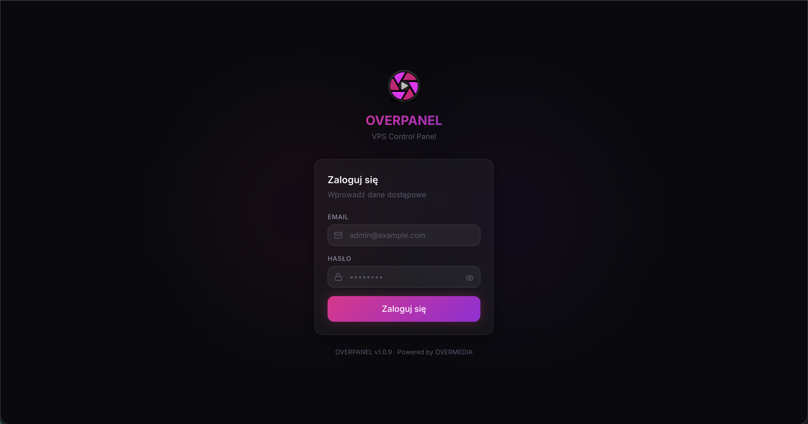 |  |

| Nowa strona WWW | Certyfikaty SSL |
|-----------------|-----------------|
| 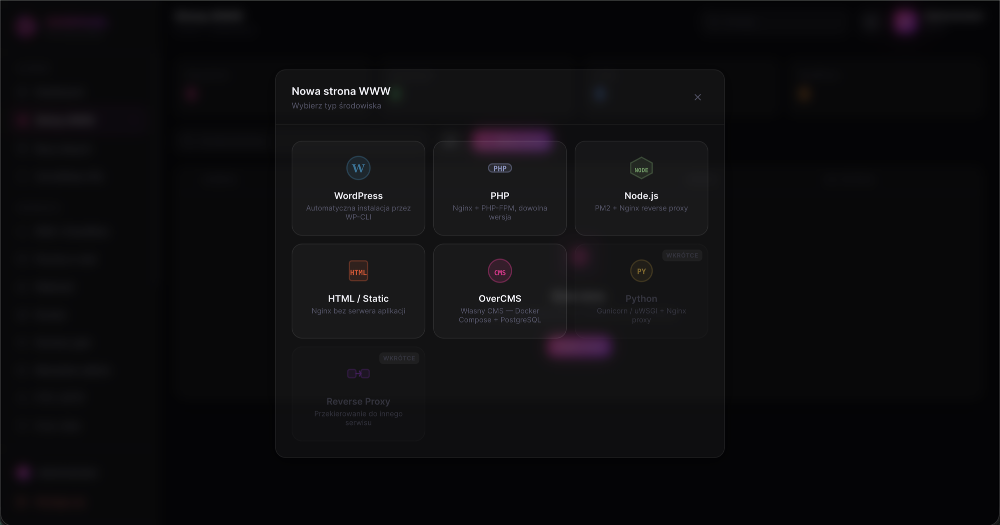 | 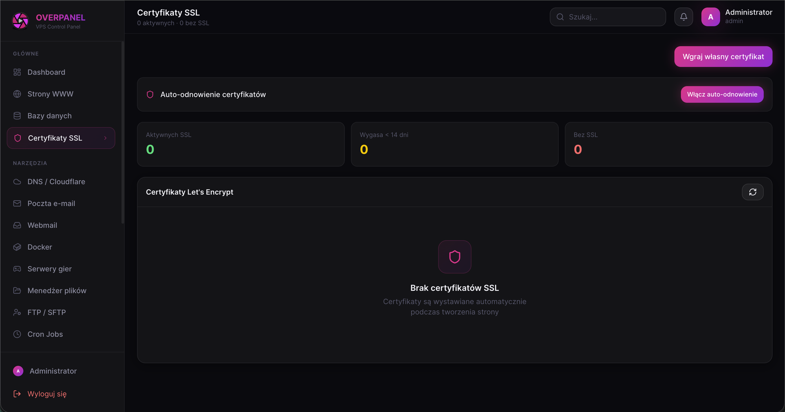 |

| Docker — kontenery | Docker — przegląd |
|--------------------|-------------------|
| 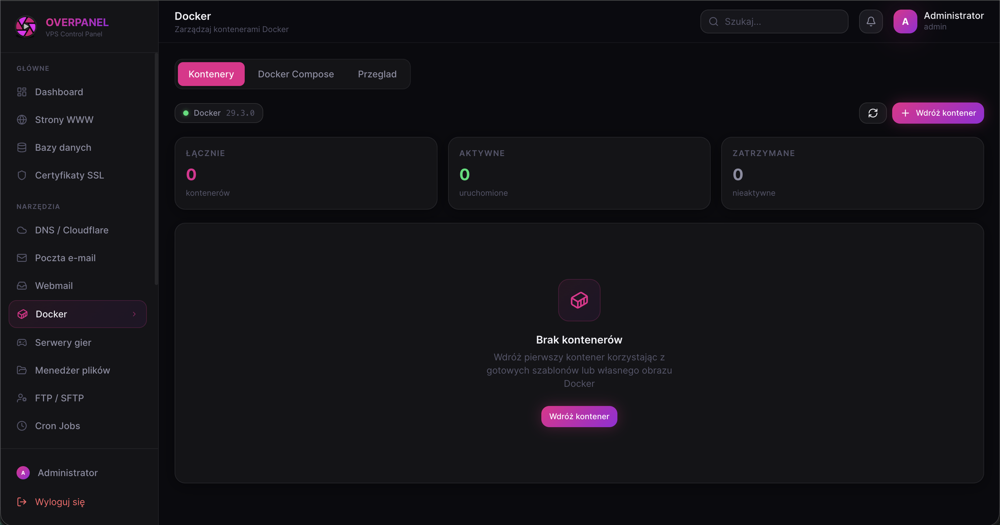 | 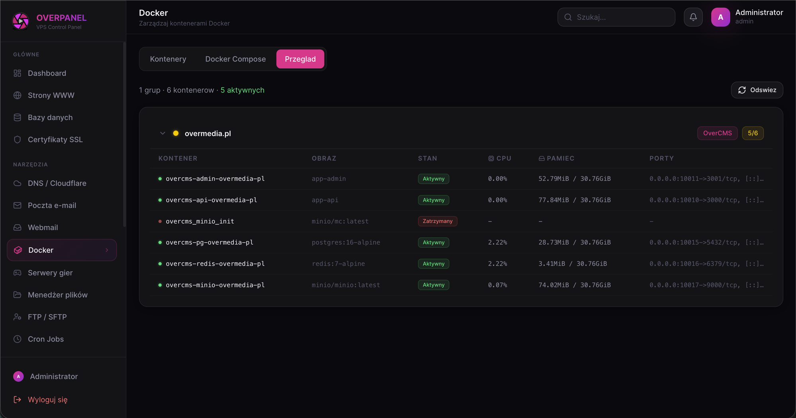 |

| Docker — szablony | Katalog serwerów gier |
|-------------------|-----------------------|
| 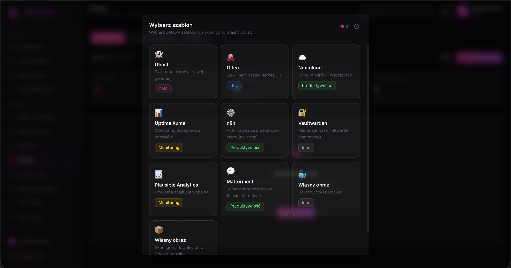 | 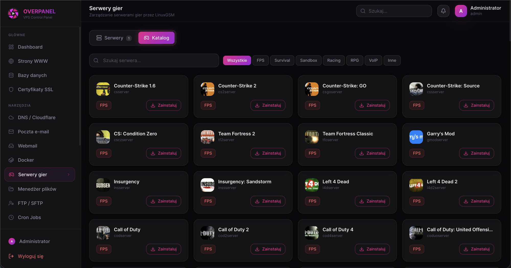 |

| Konsola serwera gry | Instalacja serwera |
|---------------------|--------------------|
| 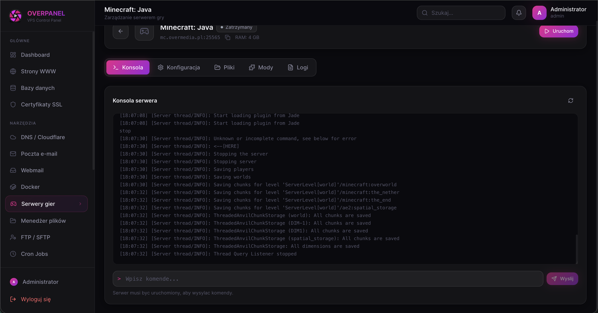 | 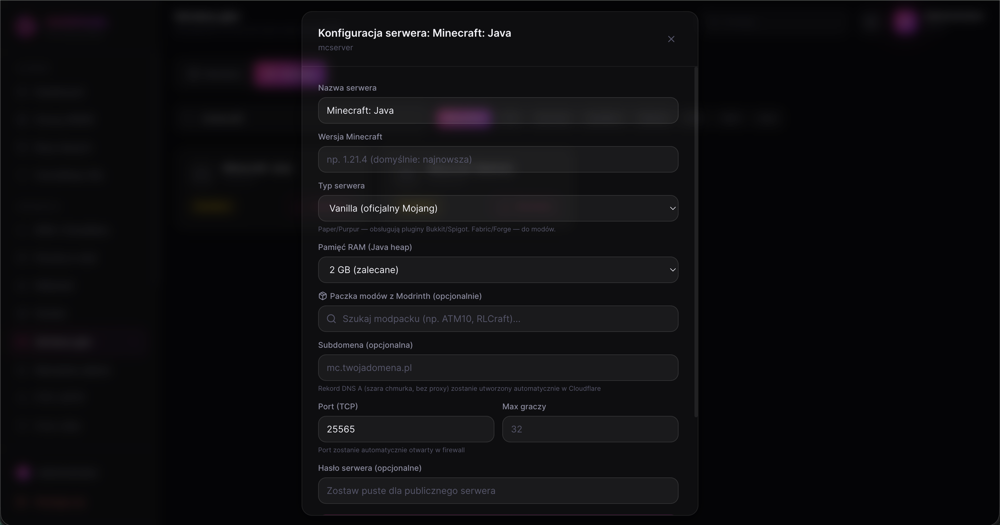 |

| FTP / SFTP | Terminal |
|------------|----------|
| 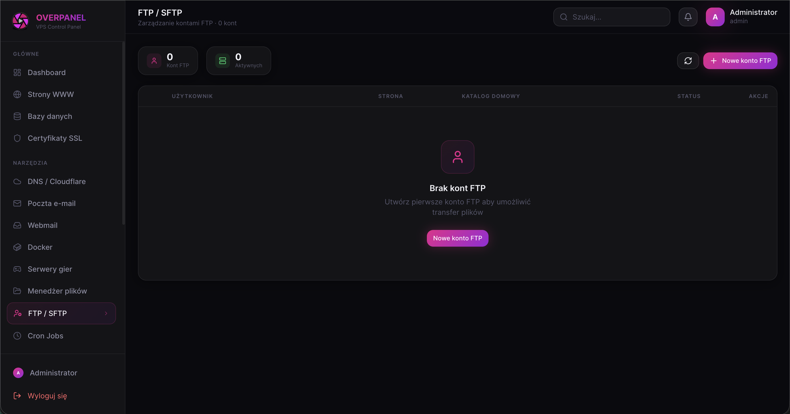 |  |

| Dyski | Aktualizacje |
|-------|--------------|
| 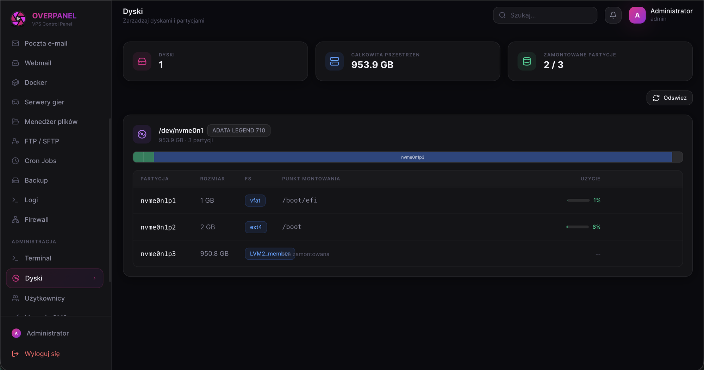 | 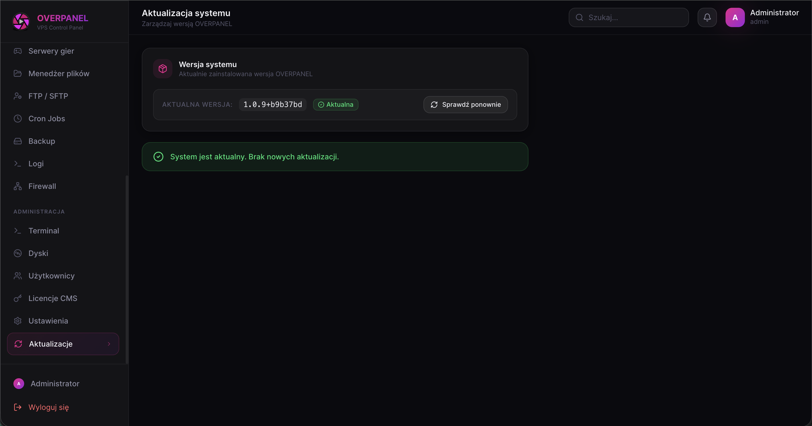 |

</div>

---

## Wymagania systemowe

| | Minimum | Zalecane |
|---|---------|----------|
| OS | Ubuntu 20.04 | Ubuntu 24.04 |
| RAM | 2 GB | 4+ GB |
| CPU | 1 vCPU | 2+ vCPU |
| Dysk | 20 GB | 50+ GB |
| Sieć | Publiczny IP | + Cloudflare (opcjonalnie) |

---

## Komendy

```bash
# Aktualizacja panelu
cd /opt/overpanel && git pull && pnpm install && pnpm build
systemctl restart overpanel-api overpanel-web

# Status serwisów
systemctl status overpanel-api overpanel-web

# Logi
journalctl -u overpanel-api -f
journalctl -u overpanel-web -f
```

---

## Licencja

Oprogramowanie własnościowe. Wszelkie prawa zastrzeżone.

**OVERMEDIA** &copy; 2026

---

<div align="center">
<sub>Zbudowane z Node.js, Next.js, Fastify, Prisma, Docker i dużą ilością kawy.</sub>
</div>
